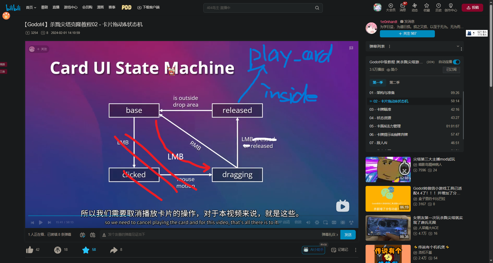

## TODOLIST

### DOING

目前正在进行的任务

#### ringcard-combat-prototype 卡牌战斗原型

- [ ] 卡牌类 Card 以及 卡牌信息 CardData 等相关基类实现
  - [x] 卡牌打出的基本逻辑/动画
  
  - [x] bug：卡牌放大缩小会导致位置偏移
    - 归类到Visual节点单独管理scale解决（这样不管怎么变visual都不会影响父节点的position）
  
  - [ ] 卡牌状态机完善
  
    ​	目前状态机
  
  
  
  - [ ] 实现打出功能
    - [ ] 目标获取 choose_targets
      - [ ] 对自己 SELF
      - [ ] 对对手 OPPONENT
      - [ ] 对地点 SITE，需要选取目标
    - [ ] 施加卡牌效果
      - [ ] 修改影响力
      - [ ] 挂一个buff（直接print）
      - [ ] 抽卡
  - [ ] 阶段性检验：Policy、Measure卡各一个实例（test_*.tres）
  - [ ] Event卡实例，抽到时自动打出
  - [ ] 手牌 自动调整位置 以及 动画
  
- [ ] 地点类 Site 以及 地点信息 SiteData 等相关基类实现

  - [x] 基础UI
  - [x] 选中高亮以及函数框架
  - [ ] card的choose_targets中需求等待选择一至多个site，需要给出对应方法
  - [ ] 右键description卡片显示

- [ ] BUFF类

### DONE

已经完成的任务记录

## SUBTODO

次要任务或其他准备之后再进行的任务

## MAYBETODO

一些还不知道要不要做的点子

