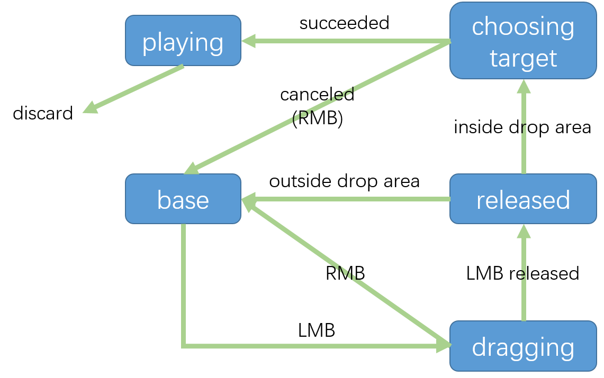

## TODOLIST

### DOING

目前正在进行的任务

- [ ] 抽牌堆、弃牌堆、手牌堆

### LIST

#### ringcard-combat-prototype 卡牌战斗原型

- [ ] 卡牌类 Card 以及 卡牌信息 CardData 等相关基类实现

  - [x] 卡牌打出的基本逻辑/动画

  - [x] bug：卡牌放大缩小会导致位置偏移

    - 归类到Visual节点单独管理scale解决（这样不管怎么变visual都不会影响父节点的position）

  - [x] 卡牌状态机完善

    ​	目前状态机

  

  - [x] 实现打出功能
    - [x] 目标获取 choose_targets，依据 target_type 参数
      - [x] 对自己 SELF
      - [x] 对对手 OPPONENT
      - [x] 对地点 SITE，需要选取目标
        - [x] 选取过程中应可取消
      - [x] 无目标 NONE
    - [x] 施加基础卡牌效果接口
      - [x] 修改影响力
      - [x] 挂一个buff（直接print）
      - [x] 抽卡
        - [x] 需要优先实现：抽牌堆、手牌（战损版）
    - [x] 检测卡牌当前是否能被打出 func can_play()
      - [x] 目前：有其他卡牌正在运作则不能打出
        - [x] battle管理current_card
  - [x] 阶段性检验：Measure卡实例
  - [x] 布尔值Controllable控制卡牌是否能被操控（状态机运行与否）
  - [ ] 阶段性检验：Policy卡实例
  - [ ] Event卡实例，抽到时自动打出

- [ ] 抽牌堆、弃牌堆、手牌

  - [x] 抽弃牌堆基类 CardPile
    - [x] 基本UI功能
    - [x] 基本抽牌弃牌接口
  - [ ] 手牌
    - [ ] 是否需要管理手牌
    - [ ] 如何自动调整手牌位置

- [ ] 地点类 Site 以及 地点信息 SiteData 等相关基类实现

  - [x] 基础UI
  - [x] 选中高亮以及函数框架
  - [x] card的choose_targets中需求等待选择一至多个site，需要给出对应方法
  - [ ] 右键description卡片显示

- [ ] BUFF类

## SUBTODO

次要任务或其他准备之后再进行的任务

- [ ] card功能完善。目前card功能需求统计：
  - [ ] 戒严：禁止ai影响力增长
  - [ ] 修改稳定度
  - [ ] 每回合多抽牌
  - [ ] 每回合多行动力
- [ ] 抽牌弃牌堆
  - [ ] 抽牌数量大于抽牌堆数量处理方法

- [ ] 动画

## MAYBETODO

一些还不知道要不要做的点子

- 若是卡牌目标是三，但是地点还没开到三个，要考虑怎么处理

- 洗牌

## NOTE

## THOUGHT

- 单机好像没有必要player和opponent节点，而如果没有这两个节点就只有 target_type 为 SITE 的卡牌要调用选目标函数了（虽然没啥影响，但记录一下）

- card名字长了会爆显示。。。但是不太想自适应，看看有什么办法

## USELESS THOUGHT

